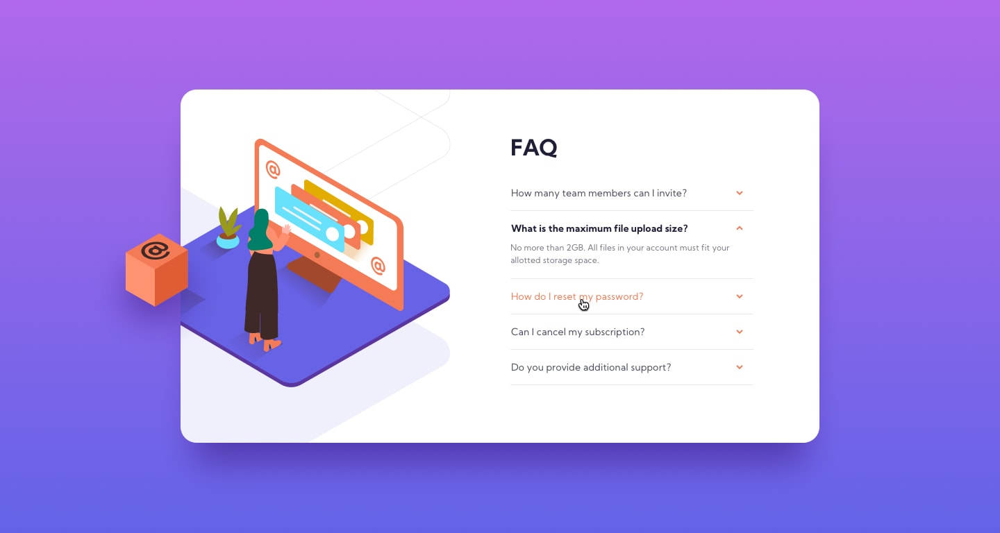

# faq-reponsive-frontendMentor
frontend mentor challenge - NEWBIE

## Welcome! 👋

## The challenge

Your challenge is to build out this FAQ accordion card and get it looking as close to the design as possible.

You can use any tools you like to help you complete the challenge. So if you've got something you'd like to practice, feel free to give it a go.

Your users should be able to:

- View the optimal layout for the component depending on their device's screen size
- See hover states for all interactive elements on the page
- Hide/Show the answer to a question when the question is clicked

## Layout

The designs were created to the following widths:

- Mobile: 375px
- Desktop: 1440px

#### Gradient

Background gradient:

- Soft violet: hsl(273, 75%, 66%)
- Soft blue: hsl(240, 73%, 65%)

### Neutral

#### Text

- Very dark grayish blue: hsl(237, 12%, 33%)
- Dark grayish blue: hsl(240, 6%, 50%)

#### Dividers

- Light grayish blue: hsl(240, 5%, 91%)

## Typography

### Body Copy

- Font size: 12px

### Font

- Family: [Kumbh Sans](https://fonts.google.com/specimen/Kumbh+Sans)
- Weights: 400, 700

#slides 

